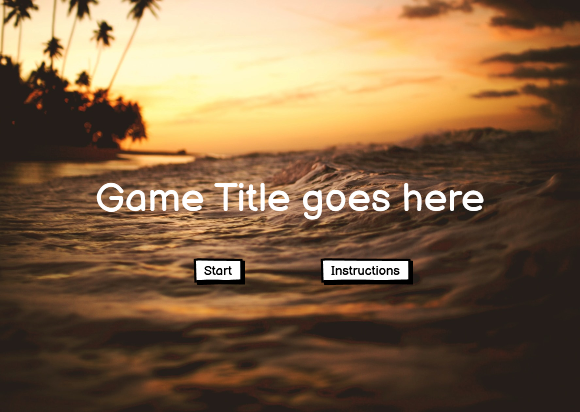
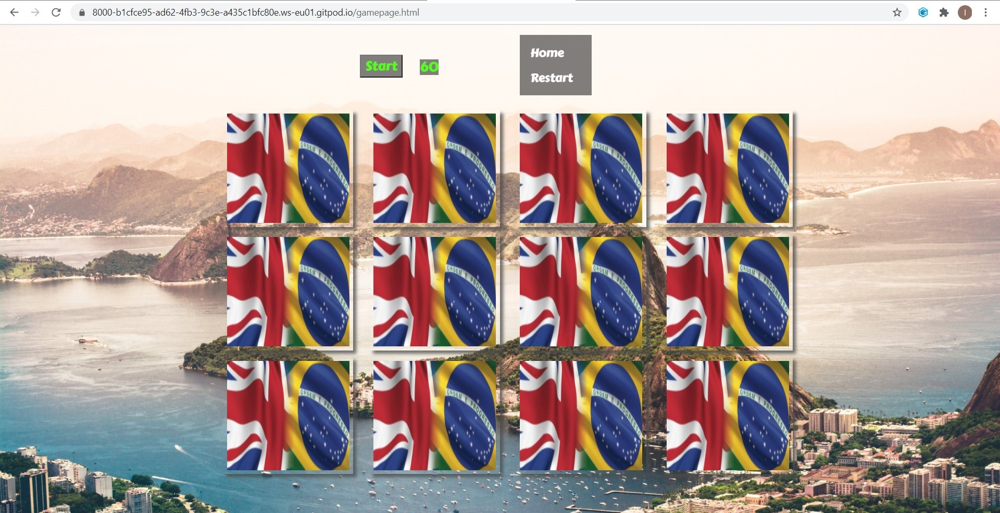
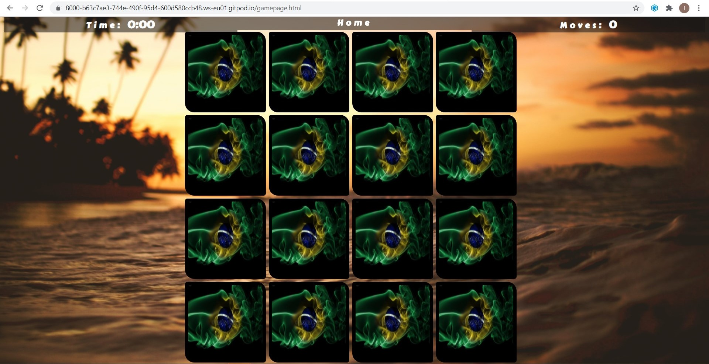

# Rio to London Memory Game 
I created this memory game to not just be a game for the memory but to help learn a basic sentence in Portuguese at the same time. This game can be expanded to learn thousands of sentences just by playing this simple game. 
I arranged the cards with nice photos as well as words to make it look more attractive and added a countdown timer that can be started when the player is ready. 
And a moves counter so that the player can see how many moves it took them to complete the game.
# UX
This game is for those who would like to learn basic words and sentences in Portuguese with ease. 
Many people find it difficult or boring to learn a language but this game is designed to make it fun and easy to learn. 
I have created three pages at the moment for one whole sentence to be learned. There is an easy, medum or difficult level. 
Each page makes the sentence a little more complex to show how easy it is to learn a language.
This is plenty for a beginner so I didn't make any other pages with different sentences for now. 
This game is very simple so that the user can focus on learning the words. There is a timer made by using javascript 
for those who want to see their progress in quickness playing the game.
A User wanting to test the game can click on the instructions button to see how the game works. Then, they can simply 
click the ‘Let’s Go’ button on the welcome page and start straight away. When they have completed the game they can restart the game to try and beat their lowest moves score last time or they can exit the game.
Additionally they can return to the welcome page a try a different level.
Here is the Wireframe sketch for my project idea. This is the Wireframe for the project on desktop and tablet view. 
The game looks best on a desktop or laptop. 

# Features
### Existing Features
* Instruction box — This tells the user how to play the game and helps them to understand the idea behind the project.
* Game Level Option — This allows the player to choose the difficulty level of the game.
* Timer — This allows the user to practice getting faster at the game and to see their own progress. 
* Restart button — This allows the user to start the game again quickly.
* Pictures on Cards — This helps the memory of the user to remember the words they have learnt for a long term recall of the words. 

Here are a few photos of the pop up modal boxes built into the game.

### Features Left to Implement
I would like to implement in the future a feature to display the words in the correct order of the sentence at the top of the page to show the whole sentence altogether. I would also like to add a voice feature that pronounces the words as they are clicked on.
## Technologies Used

## Languages Used
 Javascript
* The project uses Javascript to implement the shuffle and card matching effect. This was used to be able to intelligently restart the game so the user could play again,  match the correct cards together and flip them back over when they are not matched cards. It also shuffles the cards so that they user can play the game again without already knowing where the matched cards are. 
         The project also uses Javascript for the timer. I referred to a free code camp page to make the cards flip, shuffle and match.

 CSS
* The project uses CSS to style the welcome page, game page, buttons, navbar, cards and titles. 

 HTML
* And of course the project uses html to write the actual code. 
I also used a gitignore file to put old files in that I didn't want to use.

## Frameworks, Libraries & Programs Used
* Hover.css -
Hover.css was used on the Home button to underline the button when hovered over.
* Google Fonts -
Google fonts were used to import the 'Carter one' cursive font used on all pages.
* Git -
Git was used for version control by using the Gitpod terminal to commit to Git and Push to GitHub.
* GitHub -
GitHub is used to store the projects code after being pushed from Git.
* Photoshop -
Photoshop was used to obtain the images for the cards and background.
* Balsamiq -
Balsamiq was used to create the wireframes during the design process.

## Images 
The project also uses images for backgrounds and card photos, both the front and back of the cards use images. Here are some photos of the welcome page and the game page.  

This was the original layout and design of the page.

However I decided to change it to this (as seen below) because I think it is better looking and more uniform with the welcome page.

# Testing
## HTML Validator Testing
I have tested my code using HTML Validators and have discovered no problems. 
To test the HTML files I went to  https://validator.w3.org/#validate_by_input, entered the HTML code for both pages into the typing box, one by one. Then I clicked the run check button and it showed no errors. 
## CSS Validator Testing
To test the CSS I went to http://www.css-validator.org/, entered the CSS code into the typing box and clicked the run check button.
The code passed the validator test. 
## Javascript Validator Testing
I have also thoroughly tested the javascript code using jasmine and a Javascript Validator https://esprima.org/demo/validate.html.
## Jasmine Testing
I have followed the video tutorial on the code institute course for using Jasmine testing and have stored these files in the gitignore folder.
## Manual Testing
I have also manually tested all components of the project. All of the pages and features are working well with no bugs or problems. 
I have tested the project thoroughly on a laptop and it looks good and works well and I have tested it on my tablet and mobile. This game works best on a desktop or tablet device.

If a user wants to play the game to learn the words, they can:
* Open the project page.
* Check the instructions by clicking the instructions button.
* Click the ‘Let’s Go’ Button.
* When the pop up modal box appears the user can click the desired level of difficulty for the game.
* Start to click the cards to match the cards together, one in English and one in Portuguese that have the same pictures. They will notice that if they click on a non-matching card, the cards will flip back over and if they click on two matching cards, the cards will stay turned up.
* When the game has finished they can see how much time it took them to complete the game. They can click the ‘Restart’ Button to play again or exit the page.

Here is an image of the screen upon completing the game.

# Testing User Stories from User Experience (UX) Section
 ### As a First Time Visitor, I want to easily understand the purpose of the site.

* When entering the site users can see a neat and simple layout. The navigation buttons are easy to locate and understand, one for the instructions and one to start the game.
* The idea of the game is made clear in the instructions modal.
* The user can then try the game and see if they like it.

### As a returning Visitor, I want to see if I can improve my progress in completing the game.
* The user can start the game as normal and throughout the game see how many moves they have used by checking the 'moves' counter above the card deck.
* The user can then see how long it took them to finish the game. The well done modal will appear when they have matched all the cards together showing how long it took them to finish it.

# Deployment
To deploy my project I will push my latest code to GitHub by using the standard method of code: 
* Git commit
* Then git push
* Then I will go to my account on GitHub and locate the GitHub Repository
* When I have logged in I will go to my repositories and select the memory-game project
* Then I will select the settings tab on the menu, scroll down until the GitHub pages section and under "Source" click the dropdown called "None" and select "Master Branch".
* Then I will click save
* Then to check it has deployed I will scroll back down through the page to locate the published site link in the "GitHub Pages" section.

# Credits
### Content
The text for sections I have imitated or copied are clearly marked within my code. Here is a list of the other resources I used to complete my project. 
* **Youtube:**
Pure CSS Text Reveal From Smoke Animation Effect | CSS Animation Tutorial https://www.youtube.com/watch?v=lx3UtGiRcYA
* **Github:**
The Javascript code I have imitated from this project in Github https://github.com/afratetlay/memory_game/blob/master/index.html
* **Websites:**
https://www.freecodecamp.org/news/vanilla-javascript-tutorial-build-a-memory-game-in-30-minutes-e542c4447eae/ Memory Game in Vanilla JavaScript
### Media
The photos used in this site were obtained from Unsplash.com and Google images. 
## Acknowledgements
I received inspiration for this project from Duolingo, an excellent learning app in many languages. I would like to create my own app similar to theirs in the future. 
