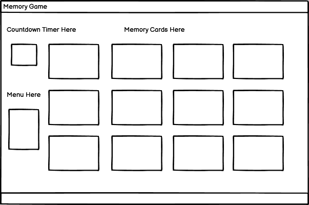

# Rio to London Memory Game 
I created this memory game to not just be a game for the memory but to help learn a basic sentence in Portuguese at the same time. This game can be expanded to learn thousands of sentences just by playing this simple game. I arranged the cards with nice photos as well as words to make it look more attractive and added a countdown timer that can be started when the player is ready. 
# UX
This game is for those who would like to learn basic words and sentences in Portuguese with ease. Many people find it difficult or boring to learn a language but this game is designed to make it fun and easy to learn. I have created one page at the moment for one whole sentence to be learned. This is plenty for a beginner so I didn't make any other pages for now. This game is very simple so that the user can focus on learning the words. There is an optional countdown timer made by using javascript for those who have learned the words and want to use the game for memory, or for those who don’t want to use the timer can first take their time learning the words and the pictures. 
A User wanting to use the project as a memory game can simply open the page, click the ‘Let’s Go’ button on the welcome page and start straight away. When they have completed the game they can return to the welcome page or simply click the restart button. 
Here is the Wireframe sketch for my project idea. This is the Wireframe for the project on desktop and tablet view. The game looks best on a desktop or laptop. 

# Features
### Existing Features
* Countdown timer — This allows the user to practice getting faster at the game and to see their own progress. 
* Restart button — This allows the user to start the game again quickly without reloading the whole site and going back to the welcome page.
* Pictures on Cards — This helps the memory of the user to remember the words they have learnt for a long term memory. 

### Features Left to Implement
I would like to implement in the future a feature to display the words in the correct order of the sentence at the top of the page to show the whole sentence altogether. I would also like to add a voice feature that pronounces the words as they are clicked on.
## Technologies Used

### Javascript
* The project uses Javascript to implement the card turning effect, shuffle and card matching effect. This was used to be able to intelligently restart the game so the user could play again,  match the correct cards together and flip them back over when they are not matched cards. It also shuffles the cards so that they user can play the game again without already knowing where the matched cards are. 
         The project also uses Javascript for the countdown timer. I used the idea from a youtube tutorial video to construct the countdown timer and I referred to a free code camp page to make the cards flip, shuffle and match.

### CSS
* The project uses CSS to style the welcome page, game page, buttons, navbar, cards and titles. 

### HTML
* And of course the project uses html to write the actual code. 
I also used a gitignore file to put old files in that I didn't want to use.

## Images 
The project also uses images for backgrounds and card photos, both the front and back of the cards use images. Here are some photos of the welcome page and the game page.  

# Testing
I have tested my code using the HTML and CSS Validators and have discovered no problems. 
To test the HTML files I went to  https://validator.w3.org/#validate_by_input, entered the HTML code for both pages into the typing box, one by one. Then I clicked the run check button and it showed no errors. 
To test the CSS I went to https://jigsaw.w3.org/css-validator/validator, entered the CSS code into the typing box and clicked the run check button.
The code passed the validator test. I have also thoroughly tested the javascript code using jasmine. 
I have also manually tested all components of the project. All of the pages and features are working well with no bugs or problems. 
If a user wants to play the game to learn the words, they can:
* Open the project page.
* Click the ‘Let’s Go’ Button.
* Start to click the cards to match the cards together, one in English and one in Portuguese that have the same pictures. They will notice that if they click on a non-matching card, the cards will flip back over and if they click on two matching cards, the cards will stay turned up.
* When the game has finished they can click the ‘Restart’ Button to play again or exit the page.
If a user wants to improve the time they can complete the game, they can:
* Open the project page.
* Click the ‘Let’s Go’ Button.
* Click the ‘Start’ Button underneath the green number 60 which is the digital countdown timer.
* Start to click the cards to match the cards together, one in English and one in Portuguese that have the same pictures. They will notice that if they click on a non-matching card, the cards will flip back over and if they click on two matching cards, the cards will stay turned up.
* When the game has finished they can see how long it took them to match up all the cards. They can click the ‘Restart’ Button to play again or exit the page.

I have tested the project thoroughly on a laptop and it looks good and works well. It is still playable on a mobile device and tablet however I would like to improve the appearance of the game on a mobile device in the future. 

# Deployment
This section should describe the process you went through to deploy the project to a hosting platform (e.g. GitHub Pages or Heroku).
In particular, you should provide all details of the differences between the deployed version and the development version, if any, including:
Different values for environment variables (Heroku Config Vars)?
Different configuration files?
Separate git branch?
In addition, if it is not obvious, you should also describe how to run your code locally.
# Credits
### Content
The text for sections I have imitated or copied are clearly marked within my code. Here is a list of the other resources I used to complete my project. 
**Youtube:**
Pure CSS Text Reveal From Smoke Animation Effect | CSS Animation Tutorial
Build your own COUNTDOWN TIMER in 15 lines of JavaScript code, Ania Kubów #JavaScriptGames
**Websites:**
freecodecamp.org Memory Game in Vanilla JavaScript
### Media
The photos used in this site were obtained from Unsplash.com and Google images. 
## Acknowledgements
I received inspiration for this project from Duolingo, an excellent learning app in many languages. I would like to create my own app similar to theirs in the future. 
